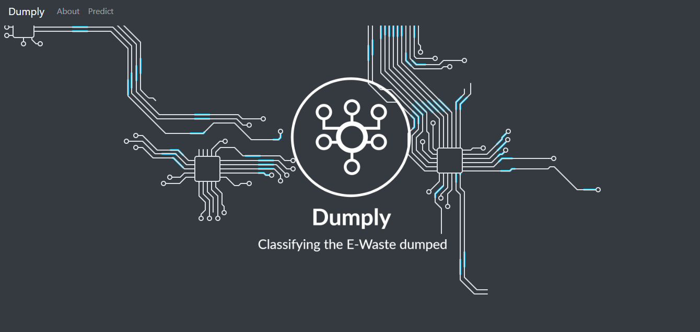
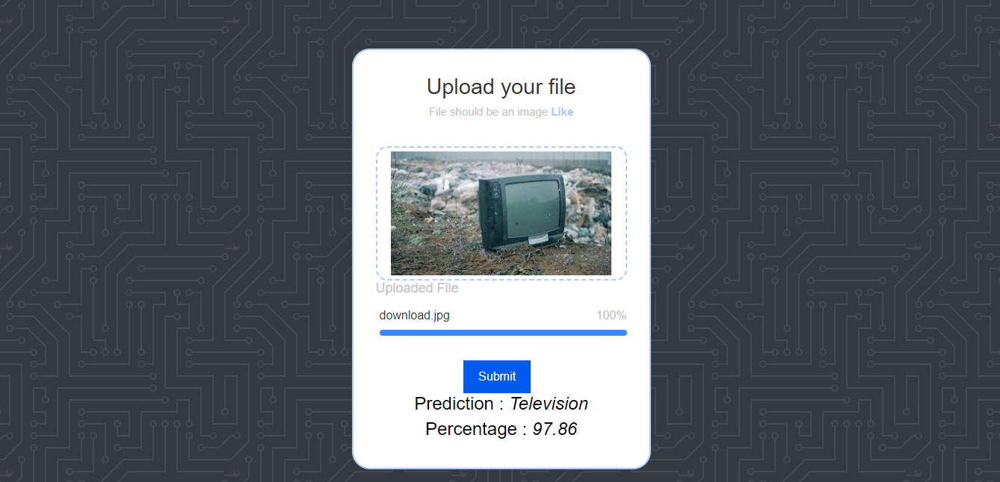

<br/>
<p align="center">
  <h3 align="center">Dumply</h3>

  <p align="center">
    Dumply is a web app designed to classify electronic waste (e-waste) into different categories.
    <br/>
    <br/>
    <a href="https://github.com/Akshat103/Dumply/issues">Report Bug</a>
    .
    <a href="https://github.com/Akshat103/Dumply/issues">Request Feature</a>
  </p>
</p>

    

## Table Of Contents

* [About the Project](#about-the-project)
* [Built With](#built-with)
* [Getting Started](#getting-started)
  * [Installation](#installation)
* [Usage](#usage)
* [Authors](#authors)
* [Acknowledgements](#acknowledgements)

## About The Project



Dumply is a web app that categorizes e-waste into five classes: Keyboard, Mouse, Laptop, Monitor/Television, and Mobile. It helps users identify the proper disposal methods for each category.

The app promotes environmentally friendly practices by ensuring e-waste is managed and recycled appropriately. Dumply aims to reduce the environmental impact of electronic devices through efficient waste classification and recycling.

## Built With

* Flask
* Python
* VGG19

## Getting Started


### Installation

To install the project locally from, follow these steps:

1. Clone the repository:
```git clone https://github.com/Akshat103/Dumply```

2. Create a virtual environment:
```python3 -m venv myenv```

3. Activate the virtual environment: 
On Linux/Mac  
```myenv/bin/activate```
On Windows   
 ```myenv\Scripts\activate```

4. Install project dependencies:
```pip install -r requirements.txt```


## Usage

As government launches an e-waste management campaign to encourage residents to recycle their electronic devices properly. As part of the campaign, we promote the use of Dumply as a tool for e-waste classification and disposal information.



### Creating A Pull Request


## Authors

* **Akshat Tamrakar** - ** - [Akshat Tamrakar](https://github.com/Akshat103) - *Create ReadME*

## Acknowledgements

* [Ansh Kanungo](https://github.com/Anshkanungo)
* [Akshat Tamrakar](https://github.com/Akshat103)
* [Rashi Vaidya](https://github.com/rashivaidya/)
